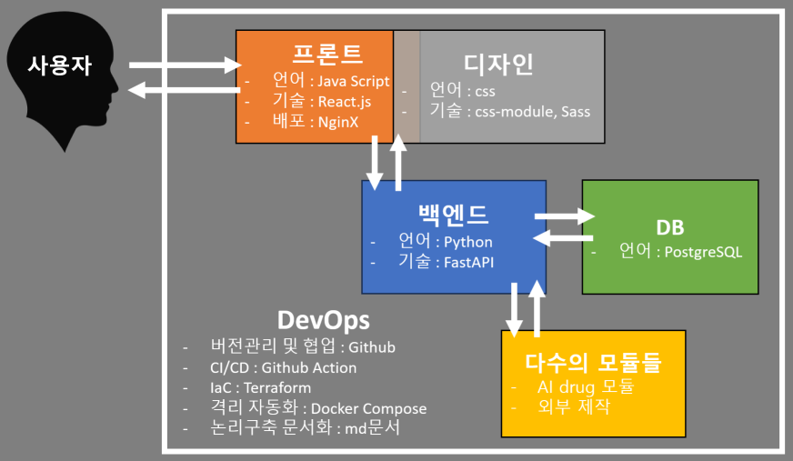

# 🤖🧠 플랫폼 DeiNoN 프로젝트 🧬⚕️

   

### 📋 항목 바로가기

1. [🎯 플랫폼 개발 정성 목표](#-플랫폼-개발-정성-목표)
2. [🗂 레파지토리 구성](#-레파지토리-구성)
3. [📟 개발 컨밴션](#-개발-컨밴션)
4. [🐛 트러블 슈팅](#-트러블-슈팅)

   

## 🎯 플랫폼 개발 정성 목표

- Micro Service Architecture (MSA)
    - 독립적인 서비스들로 구성(의존성 문제 최소화)
    - 서비스별 레파지토리 명 : DevOps(infra), 프론트(front), 백엔드(back), DB(db), 다수의 모듈들(drug-module)
- 코드 자산화
    - 무형의 프로세스를 기록함으로써 자산화
        - 프로비저닝을 코드로 진행(IaC)
        - 진행 절차와 사용되는 명령어 기록
    - 가독성에 중점을 둔 코드 작성
- 간결한 구조
    - 요구사항을 처리할 수 있는 가장 간결한 구조 탐색 
    - 논리 구축에 문서 활용 (README 파일)
        - 버전관리를 위해 깃허브가 지원하는 markdown 채택
        - 문서 작성 방식은 [개발 컨밴션 참고](#-코드베이스-구성-및-작성은-독자중심으로)

   

## 🗂 레파지토리 구성

### 🔸 🏛️ infra
- 인프라 구성 및 운영과 관련된 소스코드를 담고있음
- 기술스택
    - CI/CD : Github Action 
    - 컨테이너 : Docker
    - 오케스트레이션 : Docker Compose
    - IaC : Terraform

### 🔸 🖥️ front
- 프론트 서비스의 소스코드를 담고있음
- 기술스택
    - 언어 : JavaScript
    - UI 라이브러리 : React

### 🔸 🏭 back
- 백앤드 서비스의 소스코드를 담고있음
- 기술스택
    - 언어 : Python
    - 프레임워크 : FastAPI

### 🔸 🗄️ db
- 데이터 베이스와 관련된 소스코드를 담고 있음
- 기술스택
  - dbms : PostgreSQL

### 🔸 🔬 drug-module
- 모듈 서비스와 관련된 소스코드를 담고 있음

### 🔸 ⚙️ env
- SSOT 구현체 ([개발 컨밴션 참고](#-환경변수는-레파지토리-'env'에-저장))
- 활용 케이스
    - 데이터의 무결성, 일관성이 필요한 경우
    - 기밀성이 필요한 경우
    - 환경변수
  
### 🔸 🐙 .github  
- 본 README를 등록하기 위함
      - 깃허브 Organization 홈화면 README

   

## 📟 개발 컨밴션

### 🔹 환경변수는 레파지토리 'env'에 저장
- SSOT(Single Source of Truth) 준수
    - 모든 시스템이 하나의 데이터 소스를 참조하도록 하는것
    - 해당 프로젝트에서는 레파지토리 'env'가 구현체 ([레파지토리 설명 참고](#--env))
- 하드코딩은 최대한 지양한다
    - 부득이하게 진행되는경우 'HardCording' 문구를 주석으로 표기(검색목적)

### 🔹 코드베이스 구성 및 작성은 독자중심으로
- 프로젝트에 무지한 독자도 숲과 나무를 빠르고 정확하게 파악할 수 있는 정도
- README 파일과 주석을 활용한다.
- 설명은 논리 구축 단위를 구분하여 해당되는 대상과 가까운 곳에 배치한다.
    - 논리 단위(크기순) : 소스파일 < 디렉토리 < 레파지토리 < Organization
    - **Organization** : 전체 플랫폼을 아우르는 논리를 README 파일로 작성한다(본 문서가 해당)
    - **레파지토리** : 해당 서비스에 개괄적으로 적용되는 논리 및 사용 설명을 README 파일로 작성한다
    - **디렉토리** : 해당 디렉토리 내부에 통용되는 논리를 README 파일로 작성한다.
    - **소스파일** : 필요한 경우 소스코드에 대한 설명을 주석으로 작성한다. 

### 🔹 commit이 버전업 단위이므로 신중하게
- 커밋이력으로 원활하게 버전을 확인할 수 있도록 잦은 커밋 지양

   

## 🐛 트러블 슈팅

### 🔸 README 관련
- 깃허브 버그 추정 : 마지막 앵커가 작동하지 않음
    - 현재 문서 마지막 앵커(미작동)를 삭제하니 정상작동하던 그 위의 앵커가 작동하지 않음
    - ∴ 일단 마지막 앵커 버그상태 냅둠